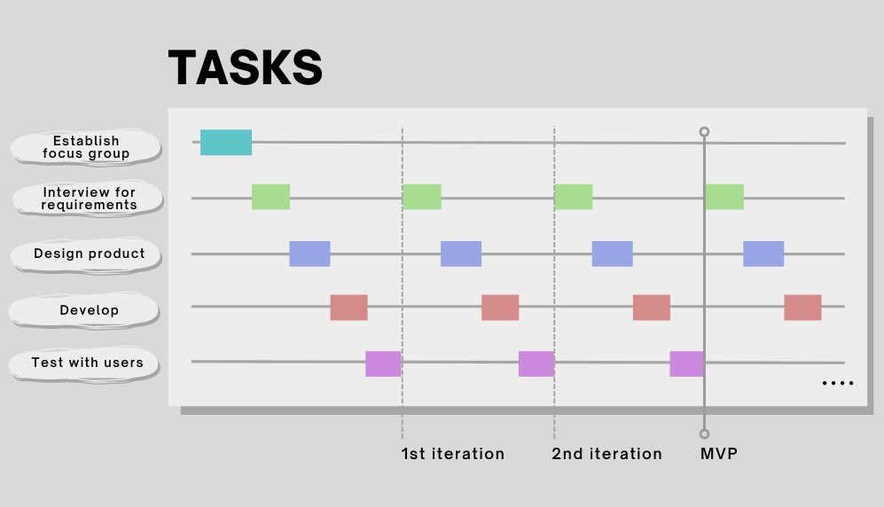

# **NotePerformer**

## Problem
When using digital engraving software, accurate portrayal of a musical piece is not always guaranteed.
The overall sound is artificial and phrasing does not sound natural, preventing the composer from having a seamless workflow. 

## Product

## Requirements
#### FUNCTIONAL
+ Sample based synthesis, in order to play instrument recordings.
+ Multiple recordings of each: Instrument $\times$ Pitch $\times$  Intensity $\times$ Technique.
+ AI model for processing output of synthesizers.
  - Large training dataset of different orchestral recordings and notation in various different configurations / situations.
  - As well as categorization of these recordings. Based on music perception and cognition.
+ Ability to toggle AI on output on/off.
+ Mixing possibilities. Volume adjustments, panning, reverb (small, med, large rooms, concert hall, church), EQ, compressor.
  1. Per staff.
  2. Per section.
  3. Master.

#### NON-FUNCTIONAL
+ Natural sounding.
  - Timbre, dynamics, articulation.
  - 70% of the focus group should be satisfied with the sound.
+ Tested and endorsed by trained composers
+ Easy parameter customization.
+ Accessible + easy to use UI, determined by the input of the focus group. 
+ Support Industry standard notation software (Sibelius, Finale, Dorico)

## Focus Group
We want to establish a focus group with approx. 80% trained composers and 20% musicologists.
The majority is composers, since they are our end users.
The musicologists can help us decide on the technical music perception and cognition factors.

## Workflow
1. Interview focus group for requirements
2. Design product
3. Develop
4. Test with users

#### Iterations and Evaluations
In the start of an iterations we hear the opinion of the focus group
on some feature, e.g. the sound of the synth. With this feedback we can
begin to (re)design some feature of the product. When we have a design finalized, we
can start the development of this feature. When the development is done,
the focus group can evaluate this feature. With this feedback, the next iteration.
can start

<figure>
<figcaption align = "center">
Visual representation of the iterative workflow.
</figcaption>

</figure>

## Milestones
1. Establish the focus group.
2. Decide important expression parameters.
3. Synth engine version 1 complete.
4. ML Model implemented. 
5. Build MVP.
6. User evaluation complete.
7. Support for industry standard notation software (Sibelius, Dorico, Finale).
8. Closed beta for larger composer audience.
9. Official release.

