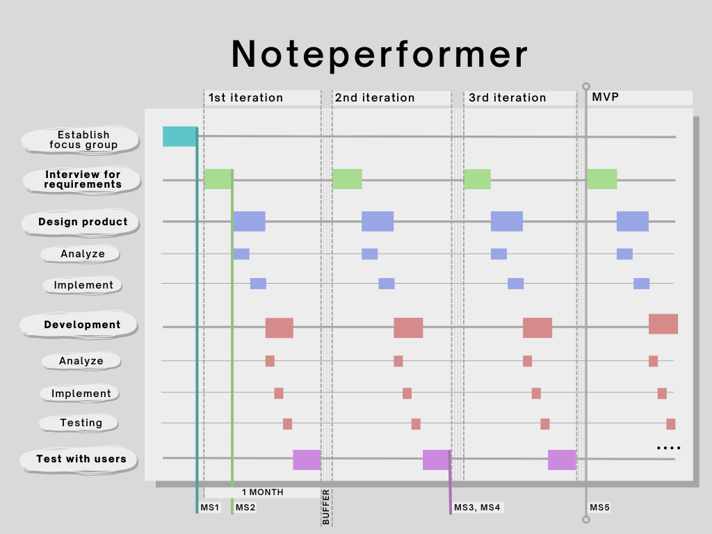

# **NotePerformer**

## Problem

## Key Elements
#### **Synth engine**
We will start out using sampled based synthesis.
This has been based on trying to have a less CPU intensive synth engine.

The form of synthesis might be changed over time,
if another alternative turns out to be more effective and realistic.

#### **ML Model**
The model alters the output of the synth with relevant characteristics of human expressiveness.
Based on specific musical contexts derived from the notation input.

The model has been trained with a combination of live recordings and the corresponding musical score.
The recordings are categorized based on their emotional and expressive properties, in addition to melody, harmony, rhythm and repetition.

#### **UI / UX** *to interact with the plugin.*

## Focus Group
Want will establish a focus group with approx. 80% composers and 20% musicologist. The majority is composers, since they are our end users.

## Workflow
##### 1. Interview focus group for requirements
##### 2. Design product
##### 3. Develop
##### 4. Test with users

## Milestones
+ Establishing the focus group.
+ Deciding on important expression parameters.
+ Deciding on form of synthesis.
+ Building MVP.
+ Closed beta for larger composer audience.
+ Release.
